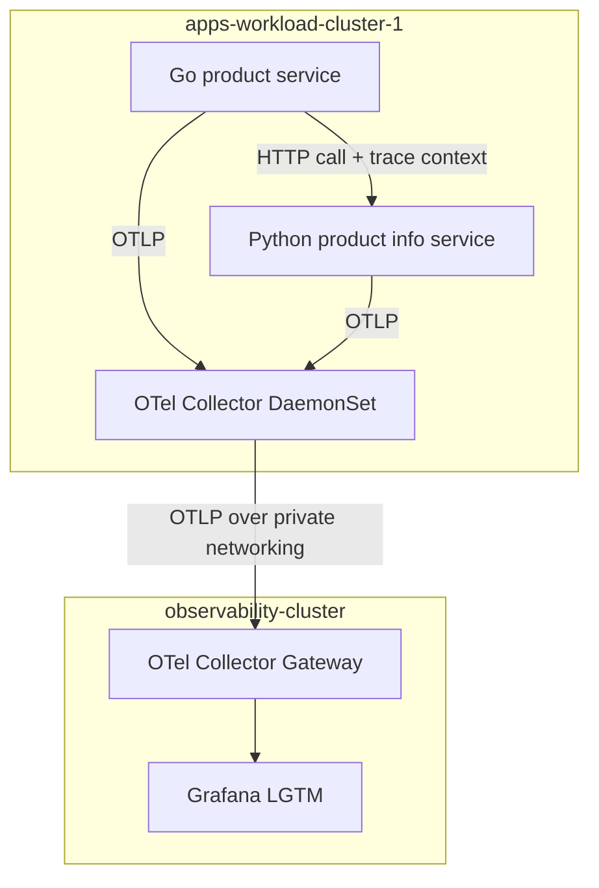

# OpenTelemetry Observability Platform Demo

Reference implementation for a multi-cluster observability platform on Amazon EKS. The demo shows how application teams can send traces, metrics, and logs through OpenTelemetry Collectors into a dedicated observability cluster, while the platform team owns routing, sampling, dashboards, and cost controls.

Built for a short demo:

1. A Go service calls a Python service and propagates W3C trace context.
2. A workload-cluster OTel Collector DaemonSet enriches telemetry with Kubernetes metadata.
3. A dedicated observability-cluster OTel Gateway applies filtering, batching, and sampling.
4. Grafana LGTM receives the telemetry for dashboards, traces, logs, and metrics.
5. `observability-platform/` contains the reusable templates you would scale across 1000+ services.

## Architecture



The demo uses the same pattern you would explain for large enterprises: lightweight collectors near workloads, centralized regional gateways for policy control, and backend-specific exporters behind the gateway.

## Repository Layout

```text
apps-workload-cluster-1/
  apps-src/                 # Go and Python demo services
  k8s-manifests/            # Workload cluster apps, instrumentation, and node collector

observability-platform/
  k8s-manifests/            # Observability cluster LGTM, Pyroscope, and gateway collector
  golden-signals/           # Reusable service dashboard templates
  telemetry-budgeting/      # Tail sampling and filtering examples
  routing-and-multitenancy/ # Tenant/team-aware routing examples
  dashboard-and-alert-generators/

terraform/
  apps-workload-cluster-1/  # Workload EKS cluster
  observability-cluster/    # Dedicated observability EKS cluster
```

## Demo Commands

```bash
make k8s-create        # Provision EKS clusters and shared AWS infrastructure
make k8s-context       # Configure kubeconfig contexts
make k8s-deploy-all    # Deploy observability stack, collectors, and apps
make k8s-dashboards    # Port-forward Grafana to http://localhost:3000
```

## At Enterprise Scale

Deploy this pattern per region:

- Application clusters run lightweight DaemonSet collectors for local enrichment and buffering.
- Dedicated regional observability clusters run gateway fleets on isolated node groups.
- Tail sampling keeps 100% of errors and latency outliers while reducing healthy high-volume traces.
- Routing processors can separate telemetry by tenant, team, environment, or backend.
- Dashboard and alert templates let teams onboard through GitOps instead of platform tickets.
- For very large bursts or backend outages, insert Kafka/MSK between ingestion and processing gateways.

See [architecture-decisions-and-tradeoffs.md](./architecture-decisions-and-tradeoffs.md) for the scale tradeoffs.

## CI/CD

GitHub Actions builds the Go and Python images from `apps-workload-cluster-1/apps-src/` and pushes them to ECR using OIDC federation.
