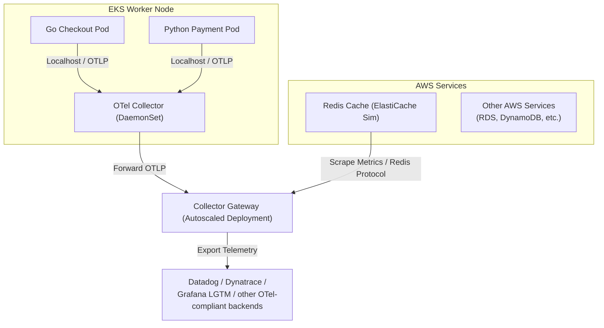

# EKS & Local OpenTelemetry Observability Sandbox

This repository is a production-ready reference implementation for running **OpenTelemetry (OTel)** on an **Amazon EKS cluster**, alongside a fully working **local sandbox** using Docker Compose.

It demonstrates a multi-service distributed transaction:
1. **Go Checkout Service** (`golang-app`): Serves as the entrypoint. When a request is triggered, it initializes a trace and makes an HTTP outbound call to the Payment service.
2. **Python Payment Service** (`python-app`): Receives the HTTP call from the Go service, processes the payment, and returns a response.
3. **Redis Cache** (`redis-cache`): Simulates Amazon ElastiCache. Performance metrics are scraped natively from Redis by the OTel Collector.
4. Both services propagate W3C trace headers, showing a single trace waterfall crossing the language boundary from Go to Python.

---

## 🏗️ System Architecture (EKS Production Topology)

For production EKS clusters, this reference architecture defines a **two-tier collector topology**:



* **Local DaemonSet Agent**: Runs on every node to collect host metrics (`hostmetrics`) and enrich container spans with Kubernetes pod metadata (`k8sattributes`) locally.
* **Autoscaled Collector Gateway**: Collects the metrics/traces from the local agents, runs memory limiting, applies tail-based sampling rules, scrapes native metrics from our Redis Cache service, and forwards all telemetry data to the appropriate storage backends.

---

## 📁 Repository Layout

```
├── .github/
│   └── workflows/
│       └── ci.yaml              # GitHub Actions CI build & push to ECR
├── Makefile                     # Root makefile wrapping local & EKS operations
├── README.md                    # This document
├── terraform/                   # AWS EKS control plane & node group infrastructure
│   ├── main.tf                  # Cluster, nodes, access configurations & ECR repositories
│   ├── variables.tf
│   └── outputs.tf
├── k8s/                         # Kubernetes manifests
│   ├── ingress.yaml             # Application load balancer ingress routing
│   ├── apps/                    # Microservices and Redis cache manifests
│   │   ├── golang-checkout-service.yaml
│   │   ├── python-payment-service.yaml
│   │   └── redis-cache.yaml
│   ├── otel/                    # Option A: OpenTelemetry Operator resources
│   │   ├── otel-instrumentation.yaml
│   │   ├── otel-collector-daemonset.yaml
│   │   └── otel-collector-gateway.yaml
│   └── otel-raw/                # Option B: Raw K8s resources (Operator-free)
│       ├── otel-agent-config.yaml
│       ├── otel-agent-daemonset.yaml
│       ├── otel-gateway-config.yaml
│       └── otel-gateway-deployment.yaml
├── scripts/                     # Cluster bootstrapping installation scripts
│   ├── install-cert-manager.sh
│   ├── install-otel-operator.sh
│   └── install-aws-alb-controller.sh
└── local-env/                   # Local compose stack configs
    ├── docker-compose.yaml
    └── collector-config.yaml
```

---

## 💻 Running the Local Sandbox

The local sandbox runs our Go checkout service, Python payment service, a Redis cache container, and the unified **`grafana/otel-lgtm`** container (which houses OTel Collector, Prometheus, Tempo, Loki, and Grafana).

### 1. Start the Stack
Spin up the local docker-compose stack:
```bash
make local-up
```

### 2. Trigger Telemetry Traffic
Trigger a mock checkout transaction on the Go app:
```bash
make local-test
```

### 3. Browse Telemetry in Grafana
1. Open **[http://localhost:3000](http://localhost:3000)** (anonymous admin access is enabled).
2. Go to **Explore** in the left sidebar and select **Tempo** as the datasource.
3. Select **Search**, choose `golang-checkout-service` as the Service Name, and click **Run Query**.
4. Click on any trace in the list. You will see a distributed trace waterfall showing:
   - The Go service executing the checkout transaction.
   - The child HTTP POST call crossing over to the `python-payment-service` to authorize the charge.
5. To view scraped Redis cache metrics, switch the datasource to **Prometheus** and query:
   ```promql
   redis_uptime_seconds_total
   ```

### 4. Stop the Stack
```bash
make local-down
```

---

## ☸️ EKS Deployment Guide

### 1. Update Kubeconfig Context
Point your local `kubectl` context to the newly created EKS cluster:
```bash
make k8s-context CLUSTER_NAME=<cluster-name> AWS_REGION=<region>
```

---

### Method A: Deploying with OpenTelemetry Operator (Recommended)

This method automates lifecycle management and auto-injection of OTel SDK wrappers into your pods using the official operator.

#### 1. Install Operator Prerequisites
Install Cert-Manager, the OpenTelemetry Operator, and the AWS Application Load Balancer Ingress Controller:
```bash
make k8s-infra CLUSTER_NAME=<cluster-name> AWS_REGION=<region>
```

#### 2. Deploy Observability Infrastructure
Deploy the operator-based auto-instrumentation rules, collector daemonset, and gateway collector:
```bash
make k8s-deploy
```

---

### Method B: Deploying with Raw Kubernetes Manifests (Operator-Free)

This method has zero external dependencies (no Cert-Manager, no Helm charts, no operator controller). It uses standard Kubernetes ConfigMaps, DaemonSets, and Deployment/Service resources.

#### 1. Install AWS Ingress Controller
```bash
CLUSTER_NAME=<cluster-name> AWS_REGION=<region> bash scripts/install-aws-alb-controller.sh
```

#### 2. Deploy Observability Infrastructure
Deploy the standard ConfigMaps, DaemonSet agent (with pod-read RBAC roles), and Gateway Deployment/Service:
```bash
make k8s-deploy-raw
```

---

> [!IMPORTANT]
> Make sure to update the image repositories in `k8s/apps/golang-checkout-service.yaml` and `k8s/apps/python-payment-service.yaml` to point to your AWS ECR Registry. Both methods deploy the same microservice application pods.

---

## 🤖 GitHub Actions CI Pipeline

The CI pipeline at `.github/workflows/ci.yaml` automates the Docker image compilation and delivery to AWS:
1. **Triggers**: Runs on pushes and pull requests to the `main` branch.
2. **AWS Authentication**: Authenticates with AWS.
3. **Build & Push**: Builds the Go and Python apps, tag them with the current git commit SHA and `latest`, and pushes them to your ECR registries.
4. **Caching**: Utilizes Github Actions caches (`type=gha`) to ensure extremely fast build times.

### Configuring Secrets in GitHub
To allow the CI pipeline to run, configure the following secrets in your GitHub repository:
- `AWS_ACCESS_KEY_ID`: AWS Access Key ID.
- `AWS_SECRET_ACCESS_KEY`: AWS Secret Access Key.

> [!TIP]
> For production environments, it is recommended to use **GitHub OIDC Role Federation** to authenticate dynamically without storing static Access Keys. Comments and instructions on how to toggle this are detailed directly in `.github/workflows/ci.yaml`.
